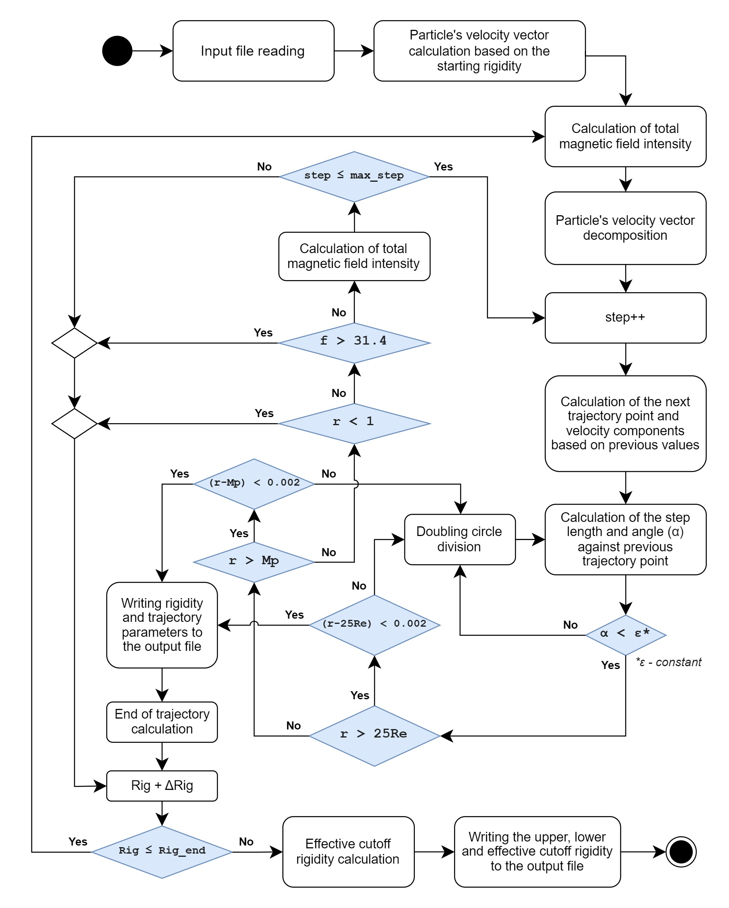

# Trajectory simulation of cosmic rays in the Earth's magnetosphere

This simulation produces calculated values of cut-off rigidities for cosmic ray trajectories, which describes spectrum of allowed and forbidden rigidities.

This program uses **Tsyganenko 04** model for simulating Earth's external magnetic field and **IGRF** (gen. 9 - 13) for simulating Earth's internal magnetic field. It was developed as refactoring of *Institute of Experimental Physics, Slovak Academy of Sciences* Fortran code.

> This is part of [cor.crmodels.org](https://cor.crmodels.org/) project.

## Compilation

For building your own executable binary, you need to have installed the following prerequisites:

- [CMake](https://cmake.org/) - v2.8.10 or newer
- [Make](https://www.gnu.org/software/make/) - v4.2.1 or newer
- [GCC](https://gcc.gnu.org/) - v9.3 (recommended)

### Building instructions

Assuming you have already cloned this repository (or downloaded and extracted ZIP archive):

1. Navigate to the project directory
2. Type `./build.sh` into the teminal
3. Executable binary `Trajectories_IGRF_T04_C` will be created inside `build` directory

## How to run the simulation

This program requires several input parameters:

1. `<INFILE>` - file, that contains data necessary for the simulation.;
2. `<OUTFILE>` - file, into which the results will be saved;
3. `<IGRF_VER>` - Version of IGRF coefficients (value: 9 - 13);
4. `<seq/par>` - Sequential or parallel computation;
5. `<number of steps>` - Max. number of the steps of the simulation.

Assuming you already have an executable binary, you can execute the program by running:
`./Trajectories_IGRF_T04_C <INFILE> <OUTFILE> <IGRF_VER> <seq/par> <number of steps>`.

In simplest versions with input file in same directory as code, command to run compiled code has the form:
`./Trajectories_IGRF_T04_C infile outfile 13 par 25000`.

### Infile example

```
  2.5000  -1.   20.0000
  1.00     48.66     20.53
            48.66     20.53
 2000  3 28  88 16 00 00
   100   1   1   0.10
   -2   0.37   2.30  -0.80
   0.04   0.03   0.06   0.01   0.03   0.02
-1.00
```

1. Line: starting rigidity; type of particle (-1 for proton); ending rigidity
2. Line: radius in `Re` - (Earth's radius); geographic latitude and longitude (of the starting point of the trajectory)
3. Line: geographic latitude and longitude for the incoming direction of the particle
4. Line: year; month; day; day in year; hours; minutes; seconds
5. Line: First 3 numbers - parameters for trajectory division; rigidity step
6. Line: `Dst` index (in `nT`); `pdyn` - dynamic pressure of solar wind (in `nPa`) at given date and time; intensity of `y` and `z` component of interplanetary field at given date and time
7. Line: W1 - W6 input parameters for external geomagnetic field model (Tsyganenko) which describes prehistory of geomagnetic field.
8. Line: `-1.00` marks the end of the input file.

> Note: Starting rigidity and ending rigidity must be the same if you want to run a precision test.

### Outfile example

```
ASYMPTOTIC COORDINATES
calculated by model of exter.field T05
 Station with geo.latitude: 48.660 & longitude: 20.530 & radius: 1.00000
 Direction of trajectory with latitude: 48.660 & longitude: 20.530
 Date: 2000 3 28 time: 16 hod 0 min 0 sec
 Starting rigidity: 2.5 GV Epsilon=0.100000
 Limit of total number of steps: 25000

 rig : v : rad : eth : efi : ath : afi : time : length
  3.500000 0.9659288526 24.348516 1.976 177.357 -1.295 193.369 1.397261 406080.81
  3.900000 0.9722833633 11.134421 -14.778 329.334 -10.356 3.128 0.678627 197938.64
  ...
  19.900000 0.9988912344 23.895048 14.815 66.211 12.526 69.865 0.483876 148820.27
  20.000000 0.9989024401 23.824049 15.035 66.083 12.740 69.722 0.475542 147421.17
  CUTOFF with rigidities P(S),P(C),P(M) are:
3.50000 3.90000 3.80000
```

This file consists of 2 parts:
- Header - contains simulation metadata (geographic coordinates, date and time, Epsilon - step in rigidity, maximum number of steps used for backtracing of one trajectory)
- Calculated data - contains trajectory parameters of cosmic rays particle with given rigidity in given time and location. Last line of the outfile includes 3 values, which describes lower, upper and effective cutoff rigidity.

> Note: This file contains different data when the precision testing binary finished executing and `PRINT_TRAJECTORY` was set to `TRUE` in `CMakeList.txt`. (See below)

## Program flowchart



## Precision testing

This code is a refactored version of already existing Fortran implementation, which was heavily tested in the past. Therefore we can assume, that the logic behind all calculations should be right. But it is possible, that some errors were introduced during the refactoring. Therefore the code is currently being tested again mainly for cumulative errors.
[See more](./docs/testing.md) 